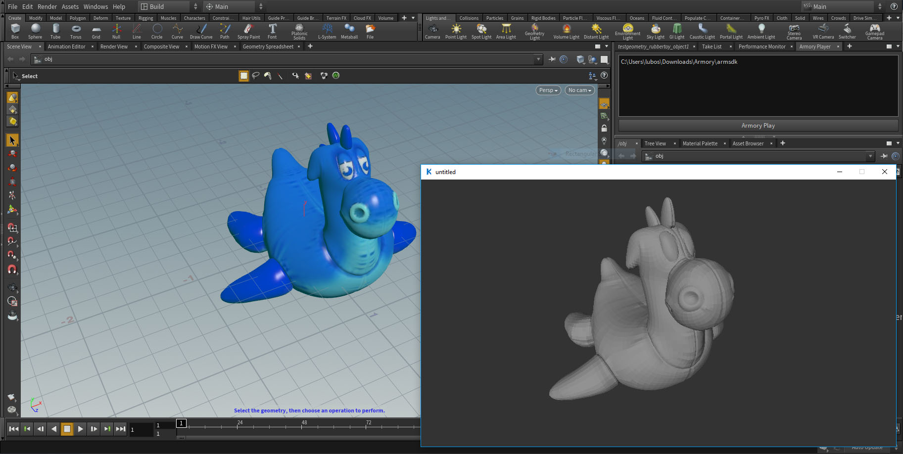

# armory_houdini

[Armory](https://github.com/armory3d/armory) + [Houdini](https://www.sidefx.com/download/). Example on integrating Armory into 3D software.

- Add `armory_player.pypanel` into Houdini through `Windows - Python Panel Editor`
- Create a new pane tab - `New Pane Tab Type - Armory Player`
- Enter [armsdk](https://github.com/armory3d/armsdk) location into the textbox
- Press `Armory Play` button

